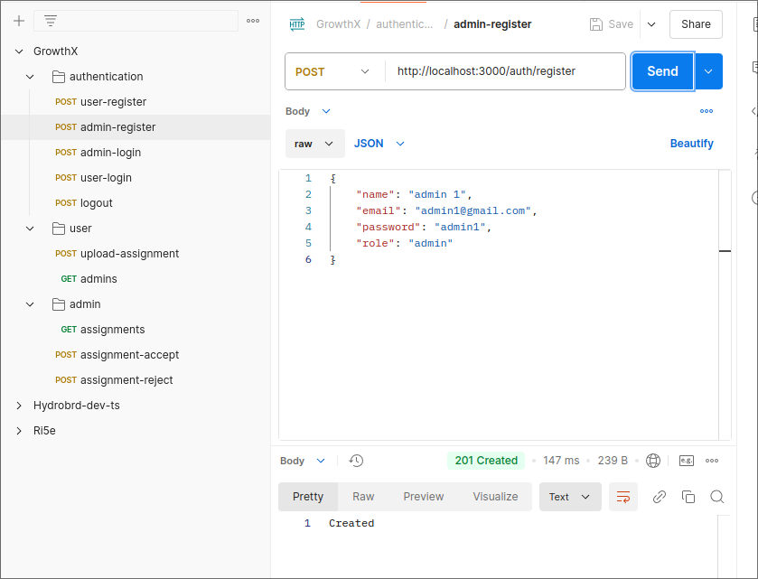

# Parth Rathod Growthx Backend Intern Assignment Submission

## Assignment Submission Portal

We have 2 types of users:
1. Admin - People who can see all the submissions and can approve or reject them.
2. User - People who can submit their assignments.

### Brief Explanation of Implementation
Built using Nodejs, Express, Typescript, MongoDB, and JWT. The project meets all the requirements mentioned in the assignment link. Below I will also attach postman screenshots for review purposes.

### Features
1. User and Admin can register and login. Authentication handled securely using JWT Tokens. 
2. User can submit their assignments.
3. User can see all admins. 
4. Admin can see all the submissions and can approve or reject them.
5. Proper Validation and Error Handling is implemented.

### Steps to run the project
1. Clone the repository.
```
git clone https://github.com/Parth0921/GrowthX-Assessment.git
```
2. Install the dependencies.
```
npm install
```
3. Create a `.env` file in the root directory and add the following environment variables. Note while submitting I have included the .env file for review purposes.
```
MONGODB_URL=<MONGODB_CONNECTION_STRING>
ACCESS_TOKEN_SECRET=<YOUR_SECRET_KEY>
GOOGLE_CLIENT_SECRET=<YOUR_GOOGLE_CLIENT_SECRET>
GOOGLE_CLIENT_ID=<YOUR_GOOGLE_CLIENT_ID>
```
4. Run the project.
```
npm run start:dev
```
5. The project will be running on `http://localhost:3000`.

### Postman Screenshots
1. Authentication- BaseURL: ```http://localhost:3000/auth/``` 
<br> <br>
    1. User Registration endpoint: ```/register``` 
    
<br> <br>
    2. Admin Registration endpoint: ```/register```
    
<br> <br>
    3. User Login endpoint: ```/login```
    
<br> <br>
    4. Admin Login endpoint: ```/login```
    
<br> <br>
    5. Logout endpoint: ```/logout```
    

2. Authentication Error Examples
    1. Invalid Password 
    
<br> <br>
    2. User does not exist
    

3. User assignment submit BaseURL- ```/user```
<br> <br>
    1. Submit Assignment endpoint: ```/upload```
    
<br> <br>
    2. Get all Admins endpoint: ```/admins/all```
    

4. Admins Portal BaseURL- ```/admin```
<br> <br>
    1. Get assignments for logged in Admin endpoint: ```/assignments```
    
<br> <br>
    2. Accept Assignment endpoint: ```/assignments/:id/accept```
    
<br> <br>
    3. Reject Assignment endpoint: ```/assignments/:id/reject```
    
